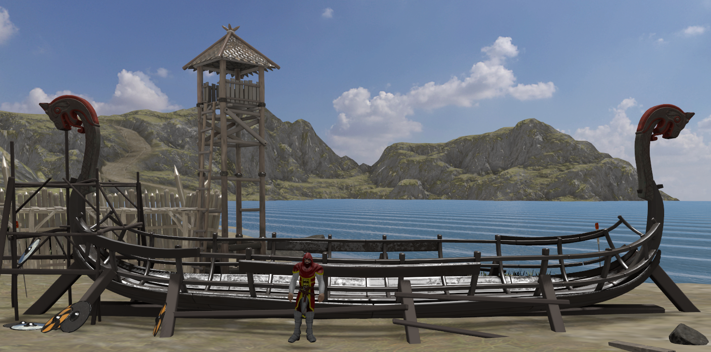

# 🏰 Vulkan 3D Medieval Village Simulator

A 3D **Medieval Village Simulator** developed in **C++ with Vulkan**.  
Step into a dynamic medieval world where you can explore, interact with NPCs, and experience advanced rendering and physics.

---

## 🚀 Getting Started

### Prerequisites
- [Vulkan SDK](https://vulkan.lunarg.com/sdk/home)
- CMake
- A C++20 compatible compiler

### Build Instructions

The following commands will clone the project repository and download all required submodules. You will then be able to build the project using CMake.
```
git clone https://github.com/MatteoArrigo/Polimi-CG-Project.git
git submodule update
mkdir build && cd build
cmake ..
make
```

## ⌨️ Keyboard Controls

- **W / A / S / D** – Move the player
- **Mouse + Click** – Look around
- **Space** – Jump
- **0** – Cycle light scenarios (morning, sunset, full moon night, dark night)
- **1** - Cycle shadowmap debug modes
- **2** – Switch camera modes (first-person, third-person, isometric, etc.)
- **E** – Interact with nearest character (dialogue)
- **Z** – Interact with environment objects (e.g., torches)


## ✨ Features

### 🎥 Multiple Camera Modes
Switch between various camera perspectives:
- First-person
- Third-person
- Shadow clip
- Isometric
- Dimetric
- Trimetric
- Cabinet

---

### ☀️ Dynamic Lighting & Shadows
- 4 different light scenarios: morning, sunset, full moon night, dark night
- Shadow mapping for character and props
- Torch lights and point lights with flickering fire effects

<p align="center">
    
</p>

---

### 🌳 Environment Rendering
- Non-flat terrain with textures and blending
- Animated water with reflections and refractions
- Grass and vegetation movement over time
- Skybox rendering

[//]: # (The following GIF is not working :( skipping... )
[//]: # ()

---

### 🏠 Village Assets
- Fully rendered buildings with PBR materials
- Props and decorative elements
- Interactive torches and environmental objects

<p align="center">
    
</p>

---

### 🤝 Interactions
- Interact with NPCs (dialogues, state changes)
- Interact with objects (torches, props, etc.)
- Prompts shown on-screen when near interactable entities

---

### ⚖️ Physics & Collision
- Real-time collision detection, powered by [bullet3](https://github.com/bulletphysics/bullet3)
- Gravity and inertia handling

⚠️ Current collision detection of the player is supposed to work correctly with terrain only. Collision detection with other props such as buildings is currently work in progress (not working very well at the moment).

<p align="center">
    
</p>
